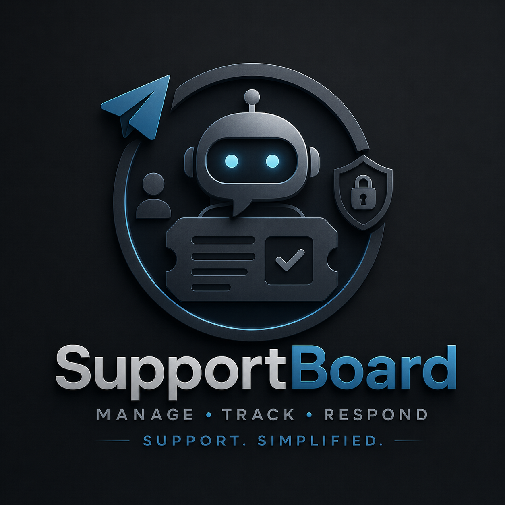

# SupportBoard


<div align="center">


A powerful Telegram bot for managing support tickets and topics with ease. Organize, track, and respond to support requests efficiently within Telegram groups.

[](https://opensource.org/licenses/MIT)
[](https://nodejs.org/)
[](https://www.docker.com/)
[](https://www.typescriptlang.org/)

[Features](#features) • [Quick Start](#quick-start) • [Container Usage](#container-usage) • [Configuration](#configuration) • [CI/CD](#cicd)

</div>

---

## 📋 Overview

**SupportBoard** is a feature-rich Telegram bot designed to streamline support ticket management. It allows teams to create, organize, and manage support topics directly within Telegram groups. With multi-language support, customizable topic limits, and flexible configuration options, SupportBoard is perfect for communities, teams, and businesses looking to centralize their support infrastructure.

The project is now distributed and deployed as a **containerized application** using Docker and GitHub Container Registry (GHCR).

## ✨ Features

- 🤖 **Telegram Bot Integration** - Direct integration with Telegram groups for seamless support management
- 📝 **Topic Management** - Create, edit, and track support topics with ease
- 🌍 **Multi-Language Support** - Built-in support for English, Ukrainian, and Russian
- 👥 **User Roles** - Admin, client, and system-level role management
- 💾 **Persistent Storage** - Secure storage system for topics and user data
- 🔐 **Key Control** - Advanced permission and authentication system
- ⚙️ **Configurable Limits** - Set maximum topic limits and manage storage retention
- 🧹 **System Messages** - Optional system message filtering to keep conversations clean
- 📊 **Data Management** - Comprehensive data handling and retrieval system
- 🐳 **Container-First Runtime** - Multi-stage Docker build for reproducible deployments
- 🚀 **Automated Image Publishing** - CI builds and pushes images to GHCR

## 🚀 Quick Start

### Prerequisites

- **Docker** 24+
- **Docker Compose** v2+
- **Telegram Bot Token** (obtain from [BotFather](https://t.me/botfather))
- **Telegram Group ID** where the bot will operate

### Installation

1. **Clone the repository**
   ```bash
   git clone https://github.com/XXanderWP/SupportBoard.git
   cd SupportBoard
   ```

2. **Create environment file**
   ```bash
   cp .env.defaults .env
   ```

3. **Edit `.env` with your Telegram values**

4. **Start with Docker Compose**
   ```bash
   docker compose up -d --build
   ```

5. **Check logs**
   ```bash
   docker compose logs -f supportboard
   ```

## 🐳 Container Usage

### Run locally via Docker Compose

```bash
docker compose up -d --build
```

Stop the service:

```bash
docker compose down
```

The service configuration is defined in `docker-compose.yml`:
- image: `ghcr.io/xxanderwp/supportboard:latest`
- mounted storage: `./.storage:/app/.storage`
- environment source: `.env`

### Run prebuilt image from GHCR

```bash
docker pull ghcr.io/xxanderwp/supportboard:latest
docker run -d \
  --name supportboard \
  --restart unless-stopped \
  --env-file .env \
  -v "$(pwd)/.storage:/app/.storage" \
  ghcr.io/xxanderwp/supportboard:latest
```

### Build image manually

```bash
docker build -t ghcr.io/xxanderwp/supportboard:local -f Dockerfile .
```

## 🧱 Container Architecture

`Dockerfile` uses a **multi-stage build**:
- `builder` stage installs dependencies and runs `npm run build`
- `runner` stage contains only runtime artifacts (`/app/bundle`)
- persistent storage is exposed through volume `/app/.storage`

## ⚙️ Configuration

Create a `.env` file in the project root based on `.env.defaults`:

```env
# Telegram Bot Configuration
# Create a bot using BotFather (@BotFather on Telegram)
TELEGRAM_BOT_TOKEN=your-telegram-bot-token

# Telegram group ID where support topics will be posted
# Use a negative number for supergroups (e.g., -1001234567890)
TELEGRAM_GROUP_ID=your-telegram-group-id

# System language for messages
# Options: 'en' (English), 'uk' (Ukrainian), 'ru' (Russian)
LANG=en

# Remove system messages (like "topic edited") from the Telegram group
REMOVE_SYSTEM_MESSAGES=true

# Keep closed topics in storage (marked as closed, not deleted)
KEEP_CLOSED_TOPICS=true

# Maximum number of topics to keep in storage
# Older topics will be deleted when this limit is exceeded
# If active topics exceed this limit, new ones cannot be created until some are closed
TOPIC_LIMITS=30
```

### Configuration Options

| Variable | Type | Default | Description |
|----------|------|---------|-------------|
| `TELEGRAM_BOT_TOKEN` | string | - | Your Telegram bot token from BotFather |
| `TELEGRAM_GROUP_ID` | number | - | The ID of your Telegram group |
| `LANG` | string | `en` | System language (en/uk/ru) |
| `REMOVE_SYSTEM_MESSAGES` | boolean | `true` | Filter out system messages |
| `KEEP_CLOSED_TOPICS` | boolean | `true` | Preserve closed topics in storage |
| `TOPIC_LIMITS` | number | `30` | Maximum number of topics allowed |

## 📖 Usage

### Available Scripts

```bash
# Build the project (TypeScript → JavaScript)
npm run build

# Watch mode - rebuild on file changes
npm run watch

# Development mode with auto-reload
npm run dev

# Run unit tests
npm run test

# Run tests in watch mode
npm run test:watch

# Run tests with coverage report
npm run test:coverage

# Run tests in CI mode (serial + coverage)
npm run test:ci
```

Coverage reports are generated into `coverage/` locally.
In GitHub Actions, the workflow uploads `coverage/` as an artifact (`coverage-report-<run_id>`).

### Local development (without Docker)

1. **Install dependencies:**
   ```bash
   npm install
   ```

2. **Build in watch mode:**
   ```bash
   npm run watch
   ```

3. **Run backend in dev mode:**
   ```bash
   npm run dev
   ```

Note: production deployment is intended to run in containers.

## 🏗️ Project Structure

```
SupportBoard/
├── .github/workflows/
│   └── build-on-main.yml        # CI build/publish workflow (GHCR)
├── Dockerfile                   # Multi-stage container build
├── docker-compose.yml           # Local/prod compose runtime
├── src/
│   ├── backend/
│   │   ├── index.ts              # Backend entry point
│   │   └── modules/              # Backend modules
│   │       ├── admin.ts          # Admin functionality
│   │       ├── client.ts         # Client-facing features
│   │       ├── data.ts           # Data management
│   │       ├── keycontrol.ts     # Permission control
│   │       ├── lang.ts           # Language handling
│   │       ├── storage.ts        # Storage management
│   │       ├── system.ts         # System utilities
│   │       └── telegram.ts       # Telegram bot integration
│   ├── frontend/                 # Frontend components
│   ├── lang/                     # Language files (en, uk, ru)
│   ├── shared/                   # Shared utilities
│   └── types/                    # TypeScript definitions
├── bundle/                       # Compiled output
├── webpack.config.js             # Webpack configuration
├── tsconfig.json                 # TypeScript configuration
├── eslint.config.mjs             # ESLint configuration
├── .prettierrc                   # Prettier configuration
└── package.json                  # Project metadata
```

## 🛠️ Development

### Tech Stack

- **Language:** TypeScript
- **Runtime:** Node.js
- **Container Runtime:** Docker
- **Bundler:** Webpack
- **Linter:** ESLint
- **Formatter:** Prettier
- **Telegram Integration:** node-telegram-bot-api

### Code Quality

The project includes:
- **ESLint** - Code style enforcement
- **Prettier** - Code formatting
- **TypeScript** - Type safety
- **Webpack** - Module bundling

### Development Workflow

1. **Write code** in TypeScript
2. **Run** `npm run watch` for automatic compilation
3. **Use** `npm run dev` for development with auto-reload
4. **Format** code with Prettier
5. **Build** with `npm run build` for production

### Making Changes

- Edit source files in `/src/` directory
- TypeScript will compile to `/bundle/` directory
- Webpack handles bundling and asset management
- ESLint and Prettier ensure code quality

## 🌐 Multi-Language Support

SupportBoard supports multiple languages. Language files are located in `src/lang/`:

- `en.json` - English
- `uk.json` - Ukrainian
- `ru.json` - Russian
- `shared.json` - Shared translations

Set your preferred language in the `.env` file using the `LANG` variable.

## 📦 Modules

### Core Modules

- **admin.ts** - Administrative functions and controls
- **ai.ts** - AI-assisted routing, context compression, and dialog summarization
- **client.ts** - Client-side operations and interactions
- **data.ts** - Data retrieval and manipulation
- **keycontrol.ts** - Authentication and permission management
- **lang.ts** - Language management and translation
- **storage.ts** - Topic and data storage operations
- **system.ts** - System-wide utilities and helpers
- **telegram.ts** - Telegram bot integration and message handling

### AI Module (`ai.ts`) Features

- **Strict routing mode** - The model either returns `REPLY|...` or escalates via `COMMAND|OPERATOR_SWITCH`.
- **Layered knowledge loading** - Base sections (`knowledge`, `project`, `role`, `rules`) are loaded from `knowledge/` and optionally from `knowledge/example/`.
- **Custom knowledge injection** - Any extra files in `knowledge/` (and optional `knowledge/example/`) are appended to the system prompt automatically.
- **JS knowledge file support** - `.js` files can export objects with `name`, `data`, and `noCache`.
- **Dynamic JS content** - `data` may be either a string or an async function, which allows runtime-generated context.
- **Knowledge cache with opt-out** - Loaded knowledge is cached in memory, but `noCache: true` forces reload on each prompt build.
- **Per-user memory** - Message history is persisted in `.ai_history/<user_id>.json`.
- **Automatic context compression** - When history exceeds `AI_MAX_HISTORY_MESSAGES`, old context is summarized and replaced with compact memory + recent context.
- **Configurable retention after compression** - Keeps the latest `AI_SAVED_MESSAGES_WHILE_COMPRESSING` messages in raw form.
- **Support dialog timeline** - Separate chat timeline is stored in `.ai_chat_history/<user_id>.json` with `who`, `message`, and `timestamp`.
- **Conversation summary generator** - Builds short support-focused summaries (intent, assistant answers, constraints, decisions, unresolved issues) and then clears temporary chat history.
- **Language-aware responses** - Uses current bot language from `LANG` integration via the language module.
- **Language-aware summaries** - Summary generation can enforce output language via current `LANG`.
- **Safety-first fallback** - On API or IO errors, methods fail safely and return `undefined` instead of breaking the bot flow.

### AI Environment Variables

Required when AI is enabled:

- `AI_ANSWER_ENABLED` - Enables AI routing/answering (`true`/`false`)
- `AI_API_KEY` or `.openai` file - API key source
- `AI_ANSWER_MODEL` - Model name for chat completions
- `AI_MAX_HISTORY_MESSAGES` - Max history size before compression
- `AI_SAVED_MESSAGES_WHILE_COMPRESSING` - Count of recent messages preserved after compression

Optional:

- `AI_BASE_URL` - Custom OpenAI-compatible endpoint
- `AI_SUMMARY_ENABLED` - Enables post-dialog summary generation
- `AI_ENABLE_EXAMPLE_KNOWLEDGE_BASE` - Includes `knowledge/example/` files into prompt context

## 🔗 Dependencies

### Main Dependencies

- `node-telegram-bot-api` - Telegram bot API wrapper
- `webpack` - Module bundler
- `typescript` - Type-safe JavaScript

### Development Dependencies

- `@typescript-eslint/parser` - TypeScript ESLint parser
- `eslint` - Code linter
- `prettier` - Code formatter
- `nodemon` - Development auto-reload
- `@types/node-telegram-bot-api` - Type definitions

## 🔄 CI/CD

GitHub Actions workflow in `.github/workflows/build-on-main.yml` automates image release on pushes to:
- `main` → alias tag `latest`
- `beta` → alias tag `beta`
- `develop` → alias tag `preview`

Pipeline behavior:
1. Reads `version` from `package.json`
2. Checks if Git tag exists, and creates it if missing
3. Checks if image `ghcr.io/xxanderwp/supportboard:<version>` already exists
4. If image does not exist: builds and pushes both `<version>` and branch alias tags
5. If image exists: re-tags existing version image to branch alias

Published image:
- `ghcr.io/xxanderwp/supportboard:<version>`
- `ghcr.io/xxanderwp/supportboard:latest|beta|preview`

## 📝 License

This project is licensed under the **MIT License** - see the [LICENSE](LICENSE) file for details.

## 🤝 Contributing

Contributions are welcome! Please feel free to submit a Pull Request. For major changes, please open an issue first to discuss what you would like to change.

## 🐛 Troubleshooting

### Bot not responding?
- Verify your `TELEGRAM_BOT_TOKEN` is correct
- Check that the bot has permissions in your Telegram group
- Ensure `TELEGRAM_GROUP_ID` is correct (use negative number for supergroups)

### Topics not saving?
- Check that storage directory (`.storage`) has write permissions
- If using Docker, ensure `./.storage:/app/.storage` volume is mounted
- Verify `TOPIC_LIMITS` is configured appropriately

### Language not changing?
- Confirm `LANG` variable is set to a supported language (en/uk/ru)
- Ensure language files exist in `src/lang/`

### Container does not start?
- Validate `.env` exists and contains required values
- Check container logs: `docker compose logs -f supportboard`
- Ensure port/network policies on host allow Telegram API access

## 📧 Support

For support, issues, or feature requests, please visit the [Issues page](https://github.com/XXanderWP/SupportBoard/issues).

---

<div align="center">

**Made with ❤️ by [XXanderWP](https://github.com/XXanderWP)**

[⬆ Back to top](#supportboard)

</div>
